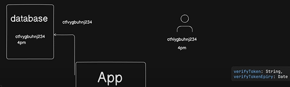

# About

This is a basic NextAuth learning repo from Chai aur code working with API based User handling including auth, management etc

# Rough Structure

- src, app-> contact-> page.ts
- App
  - Helpers
  - api
    - login -> route.ts

# Forgot Password mechanism

